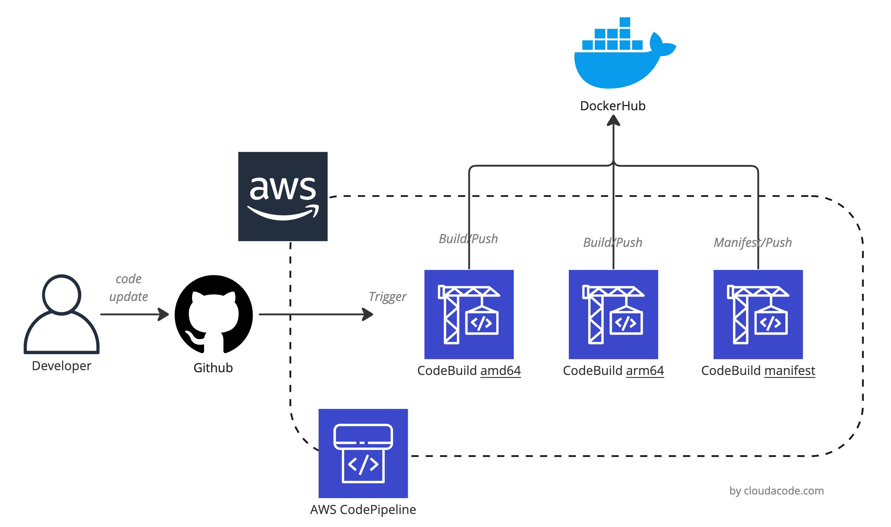

# AWS Codepipeline terraform module for building multi architecture docker images

Terraform module which build multiple architecture docker images using AWS CodeBuild and AWS CodePipeline

---
# Terraform for building multi-architecture docker images using AWS CodeBuild and AWS CodePipeline

With CodePipeline and CodeBuild, we can automate the creation of architecture-specific Docker images that you can push to DockerHub. The following diagram shows the architecture.



Root module calls these modules which can also be used separately to create independent resources:

- [codebuild](./modules/codebuild/) - creates CodeBuild projects
- [iam](./modules/iam/) - creates IAM role and Policy for projects

## Usage

Users have the ability to:

- **Option1**: Simple way

  ```hcl
  module "codepipline-github-dockerhub" {
    source             = "cloudacode/codepipline-github-dockerhub/aws"
    version            = "~> 0.1.2"
    region             = "eu-north-1"
    git_clone_http_url = "https://github.com/cloudacode/python-docker.git"
    git_branch         = "master"
    dockerhub_repo     = "cloudacode/python-docker"
    dockerhub_creds    = { username = "<login_username>", password = "<login_password>" }
  }
  ```

- **Option2**: Using OS environment

  Instead of defining credentials in a file, OS environment variables can be used in terraform variables like below.

  ```hcl
  module "codepipline-github-dockerhub" {
    source             = "cloudacode/codepipline-github-dockerhub/aws"
    version            = "~> 0.1.2"
    region             = "eu-north-1"
    git_clone_http_url = "https://github.com/cloudacode/python-docker.git"
    dockerhub_repo     = "cloudacode/python-docker"
    dockerhub_creds    = var.dockerhub_creds
  }

  variable "dockerhub_creds" {
    type = object({
      username = string
      password = string
    })
  }
  ```

  Set dockerhub login creds as OS environment
  ```bash
  export TF_VAR_dockerhub_creds='{username = "<login_username>", password = "<login_password>"}'
  ```

- **Run**: the following terraform commands in order

  ```
  # Initalize the terraform and set the modules
  terraform init
  # Simulate the changes and verify
  terraform plan
  # Apply the terraform code to deploy defined resources in real world
  terraform apply
  ```

- **Verify connnection**: login to [AWS codestar](console.aws.amazon.com/codesuite/settings/connections) and Authenticate the GitHub connection

    !!! INFO<br>
    The aws_codestarconnections_connection resource is created in the state PENDING. Authentication with the connection provider must be completed in the AWS Console.

- **Clean up**: the follwing terraform commands to delete all resources

  ```
  terraform destroy
  ```
  !!! INFO<br>
  Due to the logs are stored in the S3 Bucket, you might get error message (*deleting S3 Bucket : BucketNotEmpty: The bucket you tried to delete is not empty*) that can't delete the S3 bucket via terraform. In that case, you should **clean up/delete all objects in the S3 bucket first** and try terraform destroy again.

## Authors

Module is maintained by [KC Chang](https://github.com/cloudacode).

---
<!-- BEGIN_TF_DOCS -->
## Requirements

| Name | Version |
|------|---------|
| <a name="requirement_random"></a> [random](#requirement\_random) | 3.4.3 |

## Providers

| Name | Version |
|------|---------|
| <a name="provider_aws"></a> [aws](#provider\_aws) | 4.39.0 |
| <a name="provider_random"></a> [random](#provider\_random) | 3.4.3 |

## Modules

| Name | Source | Version |
|------|--------|---------|
| <a name="module_codebuild-amd64-project"></a> [codebuild-amd64-project](#module\_codebuild-amd64-project) | ../modules/codebuild | n/a |
| <a name="module_codebuild-arm64-project"></a> [codebuild-arm64-project](#module\_codebuild-arm64-project) | ../modules/codebuild | n/a |
| <a name="module_codebuild-manifest-project"></a> [codebuild-manifest-project](#module\_codebuild-manifest-project) | ../modules/codebuild | n/a |
| <a name="module_codebuild-pipeline-iam-role"></a> [codebuild-pipeline-iam-role](#module\_codebuild-pipeline-iam-role) | ../modules/iam | n/a |

## Resources

| Name | Type |
|------|------|
| [aws_codepipeline.codepipeline-project](https://registry.terraform.io/providers/hashicorp/aws/latest/docs/resources/codepipeline) | resource |
| [aws_codestarconnections_connection.codestare-conn](https://registry.terraform.io/providers/hashicorp/aws/latest/docs/resources/codestarconnections_connection) | resource |
| [aws_s3_bucket.codebuild-pipeline-bucket](https://registry.terraform.io/providers/hashicorp/aws/latest/docs/resources/s3_bucket) | resource |
| [aws_s3_bucket_acl.codebuild-pipeline-bucket-acl](https://registry.terraform.io/providers/hashicorp/aws/latest/docs/resources/s3_bucket_acl) | resource |
| [aws_secretsmanager_secret.dockerhub-secret](https://registry.terraform.io/providers/hashicorp/aws/latest/docs/resources/secretsmanager_secret) | resource |
| [aws_secretsmanager_secret_version.dockerhub-login-creds](https://registry.terraform.io/providers/hashicorp/aws/latest/docs/resources/secretsmanager_secret_version) | resource |
| [random_id.random-id](https://registry.terraform.io/providers/hashicorp/random/3.4.3/docs/resources/id) | resource |

## Inputs

| Name | Description | Type | Default | Required |
|------|-------------|------|---------|:--------:|
| <a name="input_dockerhub_creds"></a> [dockerhub\_creds](#input\_dockerhub\_creds) | The credentials of the DockerHub | <pre>object({<br>    username = string<br>    password = string<br>  })</pre> | n/a | yes |
| <a name="input_dockerhub_repo"></a> [dockerhub\_repo](#input\_dockerhub\_repo) | The name of the Docker Registry Repo | `string` | `"cloudacode/python-docker"` | yes |
| <a name="input_git_branch"></a> [git\_branch](#input\_git\_branch) | The name of the Git branch to be triggered | `string` | `"master"` | no |
| <a name="input_git_clone_http_url"></a> [git\_clone\_http\_url](#input\_git\_clone\_http\_url) | The name of the GitHub Repo HTTP URL | `string` | `"https://github.com/cloudacode/python-docker.git"` | yes |
| <a name="input_region"></a> [region](#input\_region) | The AWS region of the project | `string` | `"us-east-1"` | no |

## Outputs

| Name | Description |
|------|-------------|
| <a name="output_codebuild_amd64_project_name"></a> [codebuild\_amd64\_project\_name](#output\_codebuild\_amd64\_project\_name) | The project name for cloudbuild amd64 |
| <a name="output_codebuild_arm64_project_name"></a> [codebuild\_arm64\_project\_name](#output\_codebuild\_arm64\_project\_name) | The project name for cloudbuild arm64 |
| <a name="output_codebuild_manifest_project_name"></a> [codebuild\_manifest\_project\_name](#output\_codebuild\_manifest\_project\_name) | The project name for cloudbuild manifest |
| <a name="output_codepipeline_project_name"></a> [codepipeline\_project\_name](#output\_codepipeline\_project\_name) | The project name of cloudpipeline |
| <a name="output_codestart_connection_name"></a> [codestart\_connection\_name](#output\_codestart\_connection\_name) | The name of codestar connection |
| <a name="output_dockerhub_secretmanager_name"></a> [dockerhub\_secretmanager\_name](#output\_dockerhub\_secretmanager\_name) | The secretmanager name of dockerhub login creds |
| <a name="output_s3_bucket_name"></a> [s3\_bucket\_name](#output\_s3\_bucket\_name) | The name of s3 bucket |
<!-- END_TF_DOCS -->

## License

Apache 2 Licensed. See [LICENSE](https://github.com/cloudacode/terraform-aws-codepipline-github-dockerhub/blob/main/LICENSE) for full details.
